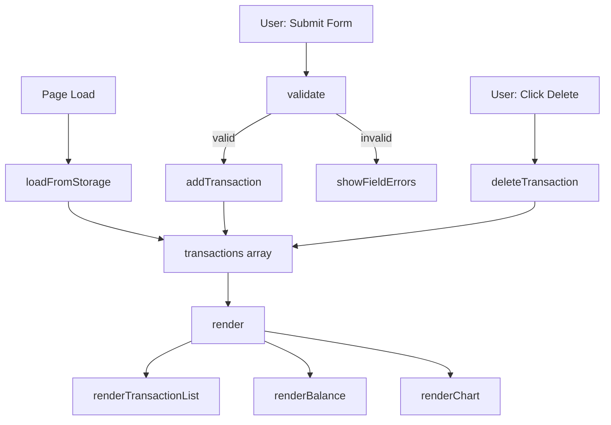

# Design Document: Expense & Budget Visualizer

## Overview

The Expense & Budget Visualizer is a fully client-side single-page application (SPA) built with plain HTML, CSS, and Vanilla JavaScript. It allows users to record expense transactions, view a running total balance, and visualize spending by category through a Chart.js pie chart. All data is persisted in the browser's `localStorage` API — no server, no build step, no framework.

The application is opened directly from the file system (`file://` protocol) or served statically. The entire runtime fits in three files: one HTML entry point, one CSS stylesheet, and one JavaScript module.

**Key design decisions:**
- **No framework**: Vanilla JS with direct DOM manipulation keeps the dependency surface minimal and ensures `file://` compatibility.
- **Chart.js via CDN**: Avoids a build toolchain while providing a mature, well-documented charting library. The CDN URL used is `https://cdn.jsdelivr.net/npm/chart.js@4/dist/chart.umd.min.js`.
- **Synchronous localStorage**: All reads and writes are synchronous, which satisfies the requirement that data is persisted before control returns to the user.
- **In-memory state as source of truth**: A single `transactions` array in JS memory is the authoritative state. The DOM and localStorage are always derived from it.

---

## Architecture

The application follows a simple **unidirectional data flow**:

```
User Action
    │
    ▼
State Mutation (transactions array)
    │
    ├──► localStorage.setItem / removeItem
    │
    └──► render() → DOM update
              ├── renderTransactionList()
              ├── renderBalance()
              └── renderChart()
```

All state changes go through a small set of mutator functions (`addTransaction`, `deleteTransaction`, `loadFromStorage`). After every mutation, a full re-render is triggered. Because the transaction list is bounded (up to ~10,000 items) and re-renders are synchronous DOM operations, this approach is fast enough to meet the 100 ms responsiveness requirement.



---

## Components and Interfaces

### File Structure

```
project-root/
├── index.html          ← single HTML entry point
├── css/
│   └── style.css       ← all styles
└── js/
    └── app.js          ← all application logic
```

### HTML Structure (`index.html`)

```
<body>
  <header>
    <h1>Expense & Budget Visualizer</h1>
    <section id="balance-section" aria-label="Total Balance">
      <Balance_Display />
    </section>
  </header>

  <main>
    <section id="form-section" aria-label="Add Transaction">
      <Input_Form />
    </section>

    <section id="list-section" aria-label="Transaction List">
      <Transaction_List />
    </section>

    <section id="chart-section" aria-label="Spending Distribution">
      <Chart />
    </section>
  </main>
</body>
```

Each major UI region is a `<section>` with a descriptive `aria-label`, providing semantic structure for screen readers.

### JavaScript Module (`js/app.js`)

The JS file is organized into the following logical sections:

#### 1. State

```js
// Single source of truth
let transactions = [];   // Array<Transaction>
```

#### 2. Data Types

```js
/**
 * @typedef {Object} Transaction
 * @property {string} id        - UUID (crypto.randomUUID or Date.now fallback)
 * @property {string} name      - Item name (1–100 chars, non-whitespace)
 * @property {number} amount    - Positive number, max 2 decimal places
 * @property {string} category  - "Food" | "Transport" | "Fun"
 */
```

#### 3. Storage Layer (`StorageService`)

| Function | Signature | Description |
|---|---|---|
| `saveTransactions` | `(transactions: Transaction[]) => void` | Serializes array to JSON and writes to `localStorage['ebv_transactions']`. Throws on quota error (caller handles). |
| `loadTransactions` | `() => Transaction[]` | Reads and parses from localStorage. Returns `[]` on missing key, parse error, or unavailability. |
| `removeTransaction` | `(id: string) => void` | Loads current array, filters out the given id, saves back. Throws on storage error. |

#### 4. Validator

| Function | Signature | Returns |
|---|---|---|
| `validateForm` | `(name: string, amount: string, category: string) => ValidationResult` | `{ valid: boolean, errors: { name?: string, amount?: string, category?: string } }` |

Validation rules:
- `name`: must be non-empty after `.trim()`, max 100 characters
- `amount`: must parse as a finite number, between 0.01 and 9,999,999.99 inclusive, max 2 decimal places
- `category`: must be one of `["Food", "Transport", "Fun"]`

#### 5. State Mutators

| Function | Description |
|---|---|
| `addTransaction(name, amount, category)` | Creates a Transaction object, pushes to `transactions`, calls `saveTransactions`, calls `render()`. |
| `deleteTransaction(id)` | Filters `transactions` by id, calls `removeTransaction(id)` on storage, calls `render()`. |
| `loadFromStorage()` | Calls `loadTransactions()`, assigns result to `transactions`, calls `render()`. |

#### 6. Render Functions

| Function | Description |
|---|---|
| `render()` | Calls all three sub-renders in sequence. |
| `renderTransactionList()` | Clears and rebuilds the `<ul>` from `transactions`. Shows empty-state message when array is empty. |
| `renderBalance()` | Computes sum of all amounts, formats as `$X.XX`, updates the balance element. |
| `renderChart()` | Computes per-category totals, updates or creates the Chart.js instance. Shows placeholder when no transactions. |

#### 7. Chart Manager

Wraps the Chart.js lifecycle:

```js
let chartInstance = null;

function renderChart() {
  const totals = computeCategoryTotals(transactions);
  // totals: { Food: number, Transport: number, Fun: number }

  if (transactions.length === 0) {
    showChartPlaceholder();
    if (chartInstance) { chartInstance.destroy(); chartInstance = null; }
    return;
  }

  hideChartPlaceholder();
  const data = buildChartData(totals);  // filters zero-value categories

  if (chartInstance) {
    chartInstance.data = data;
    chartInstance.update();
  } else {
    chartInstance = new Chart(ctx, { type: 'pie', data, options: chartOptions });
  }
}
```

Fixed category colors (consistent across updates):
- Food: `#FF6384`
- Transport: `#36A2EB`
- Fun: `#FFCE56`

#### 8. Event Handlers

- `formEl.addEventListener('submit', handleFormSubmit)` — validates, calls `addTransaction`, or shows errors
- `listEl.addEventListener('click', handleDeleteClick)` — event delegation on the list container; reads `data-id` from the delete button

#### 9. Error Display

```js
function showError(message, targetEl)  // renders a dismissible error banner near targetEl
function clearErrors()                 // removes all error banners
function showFieldError(fieldEl, message)  // shows inline error below a specific field
function clearFieldErrors()            // removes all inline field errors
```

---

## Data Models

### Transaction Object

```js
{
  id: "1718000000000-abc123",   // string: unique identifier
  name: "Coffee",               // string: 1–100 chars
  amount: 4.50,                 // number: 0.01–9999999.99
  category: "Food"              // "Food" | "Transport" | "Fun"
}
```

### localStorage Schema

- **Key**: `ebv_transactions`
- **Value**: JSON-serialized `Transaction[]`

```json
[
  { "id": "...", "name": "Coffee", "amount": 4.50, "category": "Food" },
  { "id": "...", "name": "Bus fare", "amount": 2.00, "category": "Transport" }
]
```

### Validation Result

```js
{
  valid: false,
  errors: {
    name: "Item name is required.",
    amount: "Amount must be between 0.01 and 9,999,999.99.",
    category: undefined   // no error for this field
  }
}
```

### Chart Data Structure (Chart.js format)

```js
{
  labels: ["Food", "Transport"],   // only categories with amount > 0
  datasets: [{
    data: [45.00, 12.00],          // totals per category
    backgroundColor: ["#FF6384", "#36A2EB"],
    hoverOffset: 4
  }]
}
```

---

## Correctness Properties

*A property is a characteristic or behavior that should hold true across all valid executions of a system — essentially, a formal statement about what the system should do. Properties serve as the bridge between human-readable specifications and machine-verifiable correctness guarantees.*

### Property 1: Validator rejects all invalid inputs

*For any* combination of form inputs where at least one field is invalid (name is empty or whitespace-only, amount is outside [0.01, 9999999.99] or has more than 2 decimal places, or category is not one of the three valid values), the `validateForm` function SHALL return `{ valid: false }` and the transaction list SHALL remain unchanged after a submission attempt.

**Validates: Requirements 1.2, 1.3**

---

### Property 2: Validator accepts all valid inputs

*For any* combination of form inputs where the name is a non-empty, non-whitespace-only string of at most 100 characters, the amount is a number in [0.01, 9999999.99] with at most 2 decimal places, and the category is one of "Food", "Transport", "Fun", the `validateForm` function SHALL return `{ valid: true }`.

**Validates: Requirements 1.2**

---

### Property 3: Valid submission adds exactly one transaction

*For any* valid (name, amount, category) triple, calling `addTransaction` SHALL increase the length of the `transactions` array by exactly 1, and the new entry SHALL contain the submitted name, amount, and category.

**Validates: Requirements 1.4, 2.1**

---

### Property 4: Form resets after successful submission

*For any* valid transaction submission, after `addTransaction` completes, all form fields (name input, amount input, category dropdown) SHALL be in their default empty/unselected state.

**Validates: Requirements 1.5**

---

### Property 5: Transaction list preserves insertion order (most recent first)

*For any* sequence of transactions added in order T₁, T₂, …, Tₙ, the rendered transaction list SHALL display them in reverse-insertion order: Tₙ appears first, T₁ appears last.

**Validates: Requirements 2.3**

---

### Property 6: Each rendered transaction entry contains correct formatted data

*For any* list of transactions, each rendered list item SHALL contain the transaction's item name, its amount formatted as a currency string with exactly 2 decimal places and a leading `$` symbol, and its category label.

**Validates: Requirements 2.1**

---

### Property 7: Each transaction entry has a unique delete button

*For any* list of N transactions, the rendered transaction list SHALL contain exactly N delete buttons, each carrying a `data-id` attribute that uniquely identifies its corresponding transaction.

**Validates: Requirements 3.1**

---

### Property 8: Balance always equals the sum of all transaction amounts

*For any* state of the `transactions` array (including empty), the value displayed by `renderBalance` SHALL equal the arithmetic sum of all `amount` fields, formatted to exactly 2 decimal places with a leading `$` symbol. This invariant holds after every add and every delete.

**Validates: Requirements 4.1, 4.2, 4.3, 4.4, 3.3**

---

### Property 9: Category percentages sum to 100 for any non-empty transaction list

*For any* non-empty list of transactions, the percentage values computed for the pie chart (each category's total divided by the grand total, multiplied by 100) SHALL sum to exactly 100 (within floating-point tolerance of ±0.01).

**Validates: Requirements 5.1**

---

### Property 10: Zero-spending categories are omitted from chart data

*For any* list of transactions, the chart dataset SHALL contain no entry for a category whose total spending is zero. Only categories with a positive total SHALL appear as slices.

**Validates: Requirements 5.6**

---

### Property 11: Category colors are stable across all chart updates

*For any* sequence of add and delete operations, the color assigned to each category (Food → `#FF6384`, Transport → `#36A2EB`, Fun → `#FFCE56`) SHALL remain constant and SHALL NOT change between chart renders.

**Validates: Requirements 5.5**

---

### Property 12: localStorage persistence round-trip

*For any* list of transactions saved to `localStorage` via `saveTransactions`, calling `loadTransactions` SHALL return an array that is deeply equal to the saved array (same ids, names, amounts, and categories, in the same order).

**Validates: Requirements 6.1, 6.2, 6.3**

---

### Property 13: Delete removes transaction from both memory and storage

*For any* transaction that exists in the `transactions` array, calling `deleteTransaction(id)` SHALL result in: (a) the transaction no longer appearing in the `transactions` array, and (b) `loadTransactions()` returning an array that does not contain that transaction's id.

**Validates: Requirements 3.2, 6.2**

---

## Error Handling

| Scenario | Detection | Response |
|---|---|---|
| Form field empty or invalid | `validateForm` returns errors | Inline error message per field; form not submitted; no transaction created |
| localStorage unavailable on load | `try/catch` around `JSON.parse(localStorage.getItem(...))` | Initialize with `transactions = []`; no error shown to user (silent graceful degradation) |
| localStorage write fails (quota exceeded) | `try/catch` around `localStorage.setItem(...)` | In-memory state preserved; visible error banner: "Could not save data. Storage may be full." |
| localStorage remove fails | `try/catch` around `localStorage.removeItem(...)` | Transaction kept in list; visible error banner: "Could not delete transaction from storage." |
| Chart.js CDN fails to load | `typeof Chart === 'undefined'` check on DOMContentLoaded | Error message in chart area: "Chart unavailable. Could not load charting library."; all other features continue normally |
| Transaction creation system error | `try/catch` around the add flow | Visible error banner; form fields NOT reset |

All error banners are rendered as `role="alert"` elements so screen readers announce them immediately.

---

## Testing Strategy

### Dual Testing Approach

The application uses two complementary test types:

1. **Unit / example-based tests** — verify specific behaviors, edge cases, and error conditions with concrete inputs
2. **Property-based tests** — verify universal invariants across randomly generated inputs

### Property-Based Testing Library

**[fast-check](https://github.com/dubzzz/fast-check)** (JavaScript) is the chosen PBT library. It is well-maintained, works in Node.js without a build step (via `require`), and integrates with standard test runners (Jest, Vitest).

Each property test runs a **minimum of 100 iterations**.

### Test File Organization

```
tests/
├── validator.test.js        ← unit + property tests for validateForm
├── state.test.js            ← unit + property tests for addTransaction, deleteTransaction
├── render.test.js           ← unit + property tests for renderBalance, renderTransactionList, renderChart
├── storage.test.js          ← unit + property tests for saveTransactions, loadTransactions
└── integration.test.js      ← end-to-end flow tests (add → persist → reload → delete)
```

### Property Test Tags

Each property test is tagged with a comment referencing the design property:

```js
// Feature: expense-budget-visualizer, Property 1: Validator rejects all invalid inputs
test.prop([fc.record({ name: ..., amount: ..., category: ... })])('...', ...)
```

### Unit Test Coverage

Unit tests focus on:
- Specific valid and invalid input examples for the validator
- Empty state rendering (balance = $0.00, empty-state message, chart placeholder)
- Error handling paths (localStorage unavailable, quota exceeded, Chart.js missing)
- Semantic HTML structure (labels associated with inputs, `role="alert"` on error elements)
- CDN fallback behavior

### Property Test Coverage

| Property | Test Description |
|---|---|
| P1 | `fc.record` of invalid inputs → `validateForm` returns `valid: false`, list unchanged |
| P2 | `fc.record` of valid inputs → `validateForm` returns `valid: true` |
| P3 | `fc.record` of valid inputs → `addTransaction` grows array by 1 with correct data |
| P4 | `fc.record` of valid inputs → form fields empty after `addTransaction` |
| P5 | `fc.array` of valid transactions → rendered list order is reverse-insertion |
| P6 | `fc.array` of valid transactions → each rendered item contains name, `$X.XX`, category |
| P7 | `fc.array` of valid transactions → N transactions → N unique delete buttons |
| P8 | `fc.array` of valid transactions → `renderBalance` output equals formatted sum |
| P9 | `fc.array(minLength: 1)` of valid transactions → category percentages sum to 100 |
| P10 | `fc.array` of valid transactions → chart data excludes zero-total categories |
| P11 | `fc.array` of add/delete operations → category colors unchanged across renders |
| P12 | `fc.array` of valid transactions → `loadTransactions(saveTransactions(arr))` deep-equals `arr` |
| P13 | `fc.array(minLength: 1)` of valid transactions → `deleteTransaction` removes from memory and storage |

### Accessibility Testing

- Automated: [axe-core](https://github.com/dequelabs/axe-core) integrated into the test suite to check for WCAG AA violations
- Manual: Screen reader testing with NVDA (Windows) / VoiceOver (macOS)
- Contrast: Verified with browser DevTools accessibility panel
